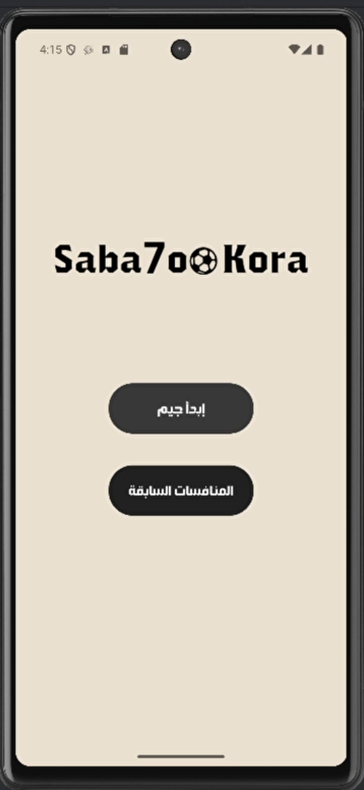
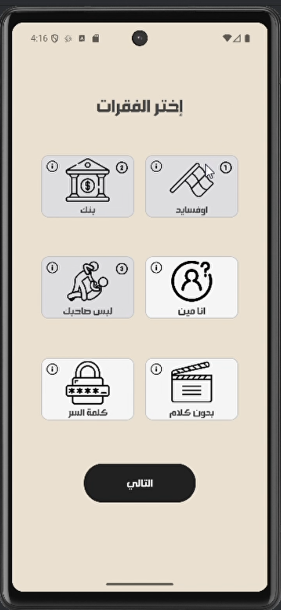
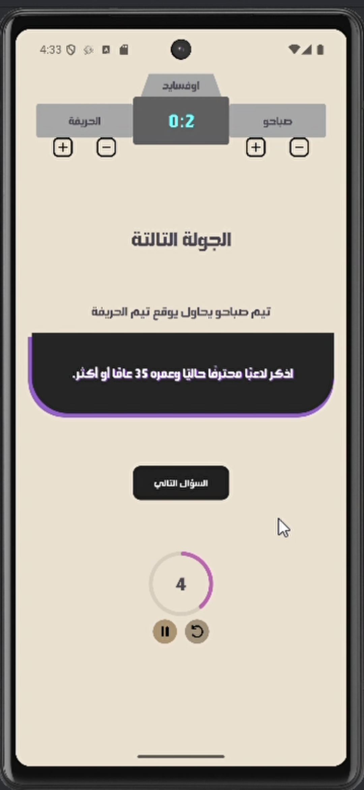
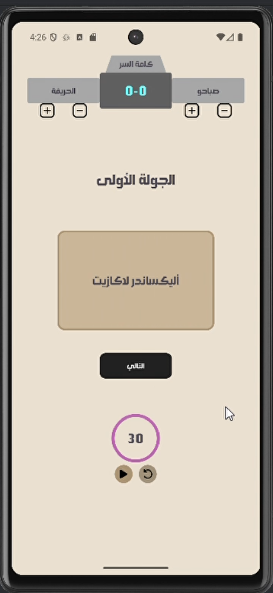
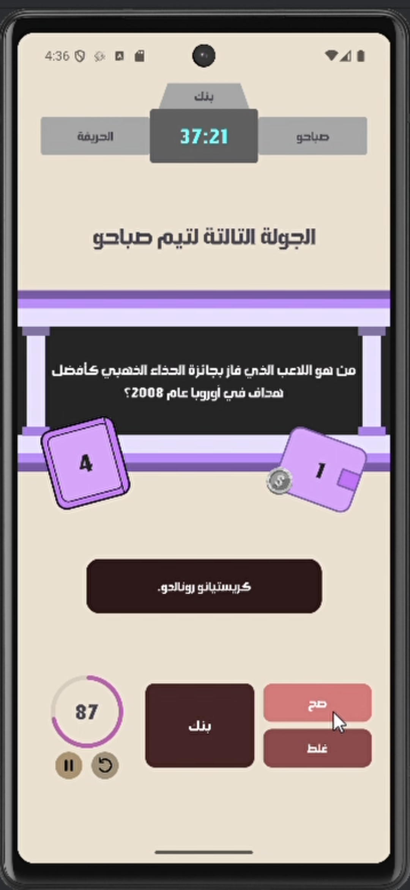
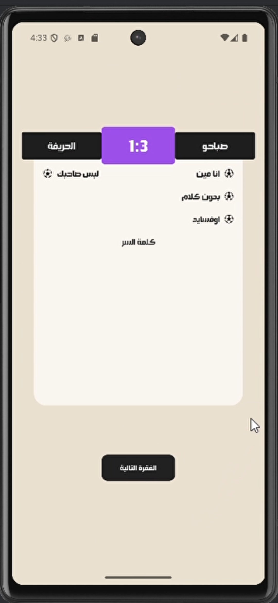

# Saba7o Kora ⚽

Saba7o Kora is a multiplayer football quiz game designed to bring a popular YouTube challenge into a mobile application.

The game is played by **two teams (2 vs 2)** while a referee controls the game using the phone.

Teams compete in a set of interactive football mini-games that test football knowledge, creativity, and teamwork.

The application handles timers, scoring, and round management, making the real-life game easier and more organized.

---

## Gameplay

- Two teams compete (2 vs 2)
- A referee operates the mobile device
- Teams select which mini-games they want to play
- Each mini-game awards **one point**
- The team that wins the majority of games wins the match

Players can freely choose the number of rounds to play.

---

## Game Rules

The game includes six football mini-games. Each game awards **one point** to the winning team.

---

### 1️⃣ Offside

A quick-thinking challenge played over **8 rounds**.

- Each round asks a question with **multiple possible answers**.
- Both players from the defending team must give **different answers**.
- If both teammates give the same answer, the point is lost.
- If answers match with the opponent team, points may also be lost.

The goal is to think fast and avoid repeating answers.

---

### 2️⃣ Password Challenge

A guessing game played in **8 rounds**.

- One player from each team sees a **hidden football player name**.
- They give **single-word hints** to help their teammate guess the player.
- The teammate who guesses correctly first wins the round.

Restrictions apply to hints (numbers, nationalities, or player names are not allowed).

---

### 3️⃣ Bank

A risk-reward trivia game played over **6 rounds**.

- Each round contains **12 football questions**.
- Teams build points by answering correctly.
- Saying **"Bank"** secures the accumulated points.
- A wrong answer resets the unbanked score.

The team with the highest total score wins the game.

---

### 4️⃣ Who Am I

A football player guessing game played over **3 rounds**.

- The referee reads **clues about a player**.
- Teams discuss and try to guess the player.
- If a team guesses incorrectly, they must wait before guessing again.

The team that wins **two rounds** wins the game.

---

### 5️⃣ Put Your Friend In Trouble

A competitive bidding challenge.

- One player from each team sees the question.
- They bid on how many answers their teammate can provide.
- The teammate must give the required number of correct answers within **30 seconds**.

Failure gives the point to the opposing team.

---

### 6️⃣ Without Talking

A football charades game.

- A player draws a **random football player name**.
- They must **act the player without speaking**.
- Their teammate has **45 seconds** to guess correctly.

If they fail, the opposing team gets a **10-second chance** to steal the point.

---

## Features

- Interactive football quiz gameplay
- Multiple mini-games with unique rules
- Built-in timers for each round
- Score tracking during matches
- Undo functionality for score correction
- Automatic scoring in specific games
- Match history to track previous games

---

## Screenshots

### Home Screen

### Game Selection

### Gameplay Example: Offside

### Gameplay Example: Password Challenge

### Gameplay Example: Bank

### Match Result

---

## Video Demo

Quick demo of the gameplay:

🎥 [Watch Demo Video](www.youtube.com)

---

## Technologies

- Kotlin
- Android Development
- UI Design
- Game Logic Implementation

---

## Future Improvements

The application is currently under development and will be released on **Google Play** in the future.

Source code is private while the project is being prepared for public release.
